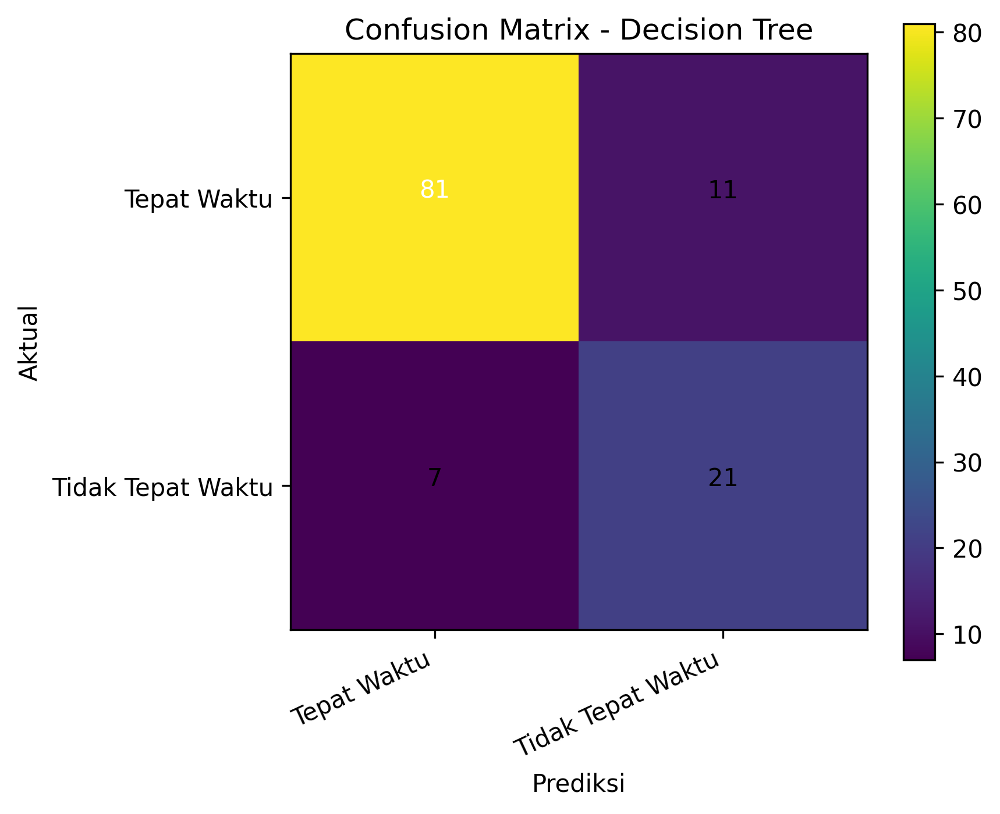
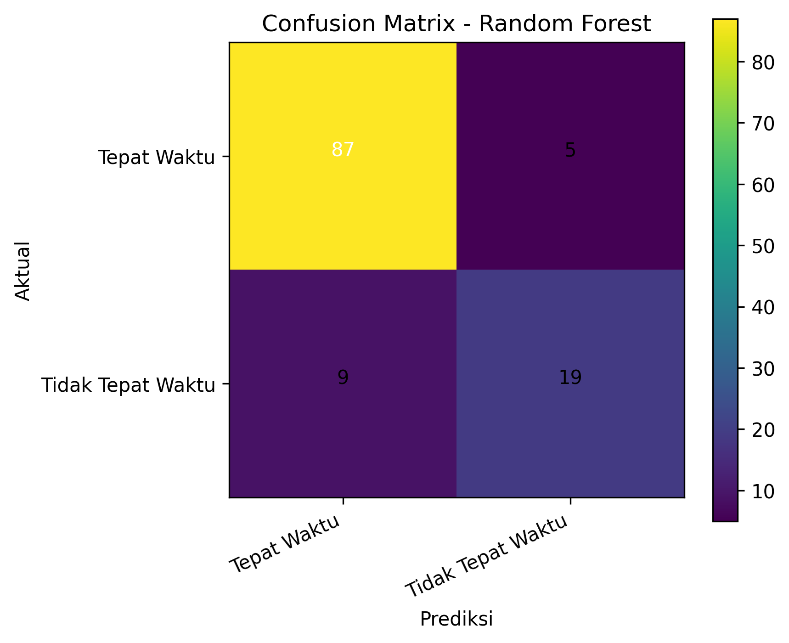
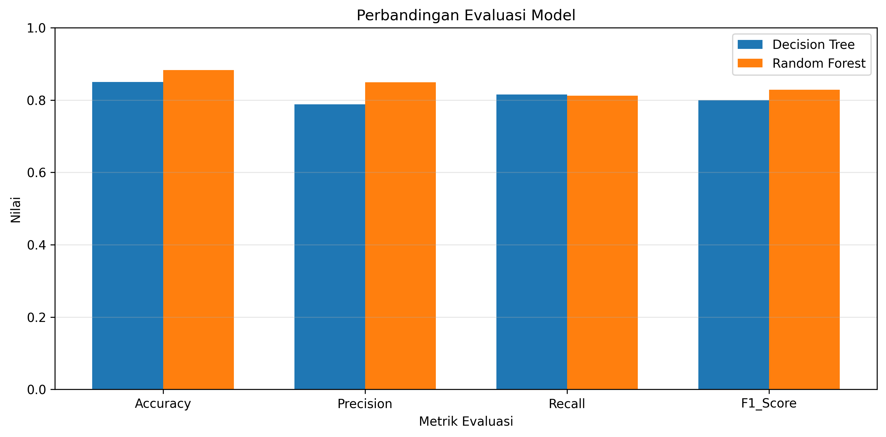
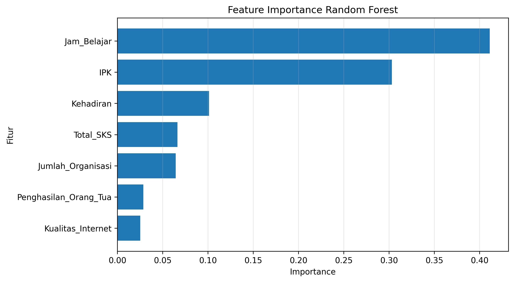

# Student Graduation Prediction with Decision Tree & Random Forest

Binary classification of on-time vs not-on-time graduation status (Tepat Waktu / Tidak Tepat Waktu) using a leakage-safe scikit-learn pipeline.

---

## Overview

This project builds and compares two classification models — a single **Decision Tree** and a **Random Forest** ensemble — to predict whether a student graduates on time. The input is a **synthetic, anonymous student dataset** containing academic and non-academic features. The raw data is intentionally dirty (duplicates, conflicting student IDs, missing values, inconsistent category casing, outliers) and is cleaned through a systematic, auditable preprocessing workflow. All statistical preprocessing lives inside an **sklearn Pipeline** and is fitted on training data only, and both models are tuned with **GridSearchCV** over Stratified K-Fold cross-validation. The full pipeline is reproducible from a pinned environment.

---

## Key Results

Official baseline, evaluated once on a held-out stratified test set (120 rows) after GridSearchCV tuning on the training set (480 rows). All numbers below are generated from the committed artifacts in [`results/`](results/).

| Model | Accuracy | Macro Precision | Macro Recall | Macro F1 |
|---|---:|---:|---:|---:|
| Decision Tree | 0.8500 | 0.7884 | 0.8152 | 0.8000 |
| **Random Forest** | **0.8833** | **0.8490** | **0.8121** | **0.8282** |

**Random Forest achieved 88.33% accuracy and 0.8282 macro F1**, outperforming the Decision Tree on this baseline (accuracy +3.3 points, macro F1 +2.8 points).

- Final modeling dataset: **600 rows** (after deduplication and ID-conflict aggregation)
- Stratified train/test split: **480 / 120**
- Hyperparameter tuning: **5-fold StratifiedKFold** with `f1_macro` selection

| Model | Best CV F1-macro |
|---|---:|
| Decision Tree | 0.8125 ± 0.0511 |
| Random Forest | 0.8921 ± 0.0292 |

---

## Problem / Objective

Given a student's academic record, classify the graduation status into one of two classes:

| Label | Meaning |
|---|---|
| `Tepat Waktu` | Graduated on time |
| `Tidak Tepat Waktu` | Did not graduate on time |

This is a **classification** problem. The project does not claim causal inference — it learns associations between input features and the observed graduation outcome.

---

## Dataset

The dataset is **synthetic and anonymous** — it does not contain real student records, personal names, or identifiable information. Student identifiers are anonymous codes of the form `MHS###`.

**Raw dataset** — tracked as [`data/student_data_raw.xlsx`](data/student_data_raw.xlsx):

- 615 rows × 9 columns
- 600 unique student IDs

**Final modeling dataset** (after cleaning, before the train/test split):

- 600 rows
- Class distribution: `Tepat Waktu` **459** (76.5%) / `Tidak Tepat Waktu` **141** (23.5%)

The two classes are **moderately imbalanced** (~3.3 : 1). This is handled by stratified splitting, `class_weight="balanced"`, and macro-averaged metrics.

**Dirty-data characteristics handled by the pipeline:**

| Issue | Handling |
|---|---|
| Full duplicate rows | Dropped (deduplication) |
| Conflicting student IDs (same ID, different values) | Aggregated per ID (median for numeric, mode for categorical/target) |
| Inconsistent category casing (e.g. `rendah` / `Rendah`) | Text normalization (strip + title case) |
| Missing values in IPK, Kehadiran, Jam_Belajar, Kualitas_Internet | Median imputation (numeric) / most-frequent (categorical), inside the pipeline |
| Outlier in Jam_Belajar (study hours far beyond the plausible range) | IQR capping, inside the pipeline |

---

## Features

| Feature | Type | Description |
|---|---|---|
| `IPK` | Numeric | Cumulative Grade Point Average (GPA) |
| `Kehadiran` | Numeric | Attendance percentage |
| `Jumlah_Organisasi` | Numeric | Number of student organizations joined |
| `Total_SKS` | Numeric | Total credit units completed |
| `Jam_Belajar` | Numeric | Study hours (weekly) |
| `Penghasilan_Orang_Tua` | Categorical | Parental income level (Rendah / Menengah / Tinggi) |
| `Kualitas_Internet` | Categorical | Internet access quality (Buruk / Sedang / Baik) |
| `Status_Kelulusan` | Target | Graduation status (see Problem / Objective) |

> **Important limitation:** `IPK` (GPA) and `Total_SKS` (credits completed) are **retrospective, end-of-study signals**. This project therefore demonstrates a **classification methodology**, not an early-warning graduation/dropout prediction system. See [Limitations](#limitations).

---

## Data Cleaning & Preprocessing

The preprocessing has two deliberately separated stages:

**1. Pre-split deterministic cleaning** (identical for every future data point, applied to the full dataset before modeling — no statistics are learned from the data):

- **Deduplication** — removal of fully identical rows
- **ID-conflict aggregation** — multiple records per student ID are merged into one row per student (median for numeric features, mode for categorical features and target)
- **Category text normalization** — trimming whitespace and standardizing casing

**2. Statistical preprocessing** (fitted inside the sklearn Pipeline, on training folds only):

- **Imputation** — `SimpleImputer` with median (numeric) and most-frequent (categorical)
- **IQR capping** — a custom `IQRCapper` transformer clips numeric outliers to `[Q1 − 1.5·IQR, Q3 + 1.5·IQR]` bounds learned from the training fold
- **Encoding** — `OrdinalEncoder` for the two categorical features (handle_unknown="use_encoded_value")

Because stage 2 lives inside the Pipeline, the imputation medians/modes and IQR bounds are recomputed for every CV fold and for the final model — using training data only.

---

## Leakage Prevention

Leakage prevention is a first-class design goal of this project:

- **Statistical preprocessing is inside the sklearn `Pipeline`** — imputation and IQR capping are not fit on the full dataset; their parameters (medians, most-frequent values, IQR bounds) are learned from training folds only.
- **GridSearchCV fits the pipeline on `X_train` only.** Cross-validation refits the preprocessing inside every fold, so validation scores never see fold-test statistics.
- **Validation occurs through StratifiedKFold** on the training set; hyperparameter selection uses `f1_macro`.
- **The test set is reserved for the final evaluation** — it is never used for tuning, model selection, or any preprocessing decision.
- Deterministic cleaning (dedup, ID aggregation, casing normalization) is applied before the split, but it involves **no data-derived statistics**, so it cannot leak test information into training.

---

## Train / Test & Validation Strategy

| Setting | Value |
|---|---|
| Split | Stratified 80/20 (`train_test_split`, stratify=y) |
| Train / Test size | 480 / 120 |
| `random_state` | 42 (split, CV, and both classifiers) |
| CV for tuning | `StratifiedKFold(n_splits=5, shuffle=True, random_state=42)` |
| Tuning metric | `f1_macro` |
| Class weighting | `class_weight="balanced"` on both classifiers |

The number of CV folds is chosen as `min(5, smallest class count)` to guarantee class representation in every fold (here: 5).

---

## Decision Tree

A single `DecisionTreeClassifier` inside the same leakage-safe Pipeline (imputation → IQR capping → encoding → classifier). Tuned via GridSearchCV over criterion, max_depth, min_samples_split, and min_samples_leaf.

**Best parameters** (from the rank-1 row in [`results/cv_results_decision_tree.csv`](results/cv_results_decision_tree.csv)):

| Hyperparameter | Value |
|---|---|
| criterion | gini |
| max_depth | 7 |
| min_samples_leaf | 1 |
| min_samples_split | 2 |

**Official test metrics:** Accuracy 0.8500 · Macro P/R/F1 0.7884 / 0.8152 / 0.8000 · Best CV F1-macro 0.8125

Per-class performance on the test set (from [`results/classification_report_decision_tree.txt`](results/classification_report_decision_tree.txt)):

| Class | Precision | Recall | F1 | Support |
|---|---:|---:|---:|---:|
| Tepat Waktu | 0.92 | 0.88 | 0.90 | 92 |
| Tidak Tepat Waktu | 0.66 | 0.75 | 0.70 | 28 |

---

## Random Forest

A `RandomForestClassifier` inside the same leakage-safe Pipeline, tuned over the same dimensions plus `n_estimators`.

**Best parameters** (from the rank-1 row in [`results/cv_results_random_forest.csv`](results/cv_results_random_forest.csv)):

| Hyperparameter | Value |
|---|---|
| criterion | gini |
| max_depth | 7 |
| min_samples_leaf | 2 |
| min_samples_split | 5 |
| n_estimators | 200 |

**Official test metrics:** Accuracy 0.8833 · Macro P/R/F1 0.8490 / 0.8121 / 0.8282 · Best CV F1-macro 0.8921

Per-class performance on the test set (from [`results/classification_report_random_forest.txt`](results/classification_report_random_forest.txt)):

| Class | Precision | Recall | F1 | Support |
|---:|---:|---:|---:|---:|
| Tepat Waktu | 0.91 | 0.95 | 0.93 | 92 |
| Tidak Tepat Waktu | 0.79 | 0.68 | 0.73 | 28 |

In the official baseline, Random Forest outperformed the Decision Tree on accuracy and macro F1. This comparison reflects this dataset and this evaluation setup — it is not a claim that Random Forest is universally better.

---

## Hyperparameter Tuning

Both models are tuned with `GridSearchCV` under identical conditions (same folds, same `f1_macro` selection, same pipeline structure), so the comparison is fair:

| Hyperparameter | Decision Tree best | Random Forest best |
|---|---|---|
| criterion | gini | gini |
| max_depth | 7 | 7 |
| min_samples_leaf | 1 | 2 |
| min_samples_split | 2 | 5 |
| n_estimators | — | 200 |

Search spaces (grids):

- Decision Tree: criterion ∈ {gini, entropy} · max_depth ∈ {3, 5, 7, None} · min_samples_split ∈ {2, 5, 10} · min_samples_leaf ∈ {1, 2, 4}
- Random Forest: the above plus n_estimators ∈ {100, 200}

Full per-candidate CV scores are committed in [`results/cv_results_decision_tree.csv`](results/cv_results_decision_tree.csv) and [`results/cv_results_random_forest.csv`](results/cv_results_random_forest.csv).

---

## Evaluation Results

Comparison of official test metrics (from [`results/hasil_evaluasi_model.csv`](results/hasil_evaluasi_model.csv)):

| Model | Accuracy | Macro Precision | Macro Recall | Macro F1 |
|---|---:|---:|---:|---:|
| Decision Tree | 0.8500 | 0.7884 | 0.8152 | 0.8000 |
| Random Forest | 0.8833 | 0.8490 | 0.8121 | 0.8282 |

Confusion matrices (rows = actual, columns = predicted; class order: Tepat Waktu, Tidak Tepat Waktu):

| Model | Matrix |
|---|---|
| Decision Tree | [[81, 11], [7, 21]] |
| Random Forest | [[87, 5], [9, 19]] |







---

## Feature Importance

Random Forest feature importances (from [`results/feature_importance_random_forest.csv`](results/feature_importance_random_forest.csv)):

| Feature | Importance |
|---|---:|
| Jam_Belajar (study hours) | 0.4112 |
| IPK (GPA) | 0.3030 |
| Kehadiran (attendance) | 0.1012 |
| Total_SKS (credits) | 0.0663 |
| Jumlah_Organisasi (organizations) | 0.0645 |
| Penghasilan_Orang_Tua (parental income) | 0.0286 |
| Kualitas_Internet (internet quality) | 0.0252 |



> **Caveat:** Feature importance measures predictive contribution within this trained model — it is **not** evidence of causation.

---

## Project Structure

```text
project-root/
├── README.md
├── requirements.txt
├── .gitignore
├── data/
│   └── student_data_raw.xlsx        # synthetic, anonymous raw dataset
├── src/
│   ├── config.py                    # paths, columns, split/model settings
│   ├── main.py                      # end-to-end pipeline entry point
│   ├── preprocessing.py             # cleaning, dedup, aggregation, audits
│   ├── modeling.py                  # pipelines, GridSearchCV, evaluation
│   ├── visualization.py             # distribution/audit/eval plots
│   └── utils.py                     # helpers (dirs, saving, mode/text utils)
├── results/                         # committed official baseline artifacts
│   ├── hasil_evaluasi_model.csv
│   ├── classification_report_decision_tree.txt
│   ├── classification_report_random_forest.txt
│   ├── confusion_matrix_decision_tree.png
│   ├── confusion_matrix_random_forest.png
│   ├── perbandingan_evaluasi_model.png
│   ├── feature_importance_random_forest.csv
│   ├── feature_importance_random_forest.png
│   ├── cv_results_decision_tree.csv
│   ├── cv_results_random_forest.csv
│   └── provenance.txt               # full run provenance
├── models/                          # generated locally by the pipeline (git-ignored)
└── outputs/                         # generated locally by the pipeline (git-ignored)
```

---

## Installation

Requires **Python 3.11** (the official portfolio baseline was generated with Python 3.11.9 and scikit-learn 1.5.2; all pins are in [`requirements.txt`](requirements.txt)).

**Windows:**

```cmd
py -3.11 -m venv .venv
.venv\Scripts\activate
python -m pip install -r requirements.txt
```

**Linux / macOS:**

```bash
python3.11 -m venv .venv
source .venv/bin/activate
python -m pip install -r requirements.txt
```

---

## How to Run

```cmd
python src\main.py        (Windows)
python src/main.py        (Linux/macOS)
```

The pipeline runs end to end: audit → cleaning → distributions → tuning (GridSearchCV) → training → evaluation → export.

Generated artifacts:

- `models/` — trained model pickles + label encoder (generated locally, **not committed**; see Reproducibility)
- `outputs/` — full visualization set, audit CSVs, classification reports (generated locally, **not committed**)
- `results/` — the **committed official baseline snapshot** from a verified pinned-environment run, curated for review

---

## Reproducibility

- `RANDOM_STATE = 42` everywhere: split, cross-validation, and both classifiers
- Stratified split + StratifiedKFold with fixed seed
- Dependency pins in `requirements.txt`
- Full run provenance (HEAD commit, environment, pip freeze, dataset hash, commands, and all official metrics) is committed at [`results/provenance.txt`](results/provenance.txt)
- The official baseline was generated with **scikit-learn 1.5.2** in an isolated environment; the key evaluation figures were reproduced **byte-identically** to the project's historical output
- Model pickles are **version-sensitive** across scikit-learn releases, so they are deliberately not committed — they are regenerated locally by running the pipeline
- Note on cross-version behavior: a later audit run under scikit-1.9.x produced slightly different Random Forest numbers; that run is **not** the portfolio baseline and is recorded only as a cross-version comparison reference in the provenance file

---

## Limitations

- **Synthetic dataset** — not real academic records; results demonstrate methodology, not real-world performance
- **Small data** — ~600 modeling rows; metrics on a 120-row test set carry non-trivial variance
- **Class imbalance** — 76.5% / 23.5%; macro metrics and class weighting are used, but recall on the minority class remains the hardest metric (RF: 0.68)
- **Retrospective features** — `IPK` and `Total_SKS` are end-of-study signals; this is a classification study, **not an early-warning deployment system**
- **Single train/test split** — no repeated split or nested-CV estimate of metric variance
- `OrdinalEncoder` applied to nominal categorical features (adequate for tree-based models, but not a one-hot scheme)
- No probability calibration
- Feature importance is not causal evidence
- Generalization to real institutions is not established

---

## Tech Stack

- **Python 3.11** — language runtime
- **pandas** — data handling, Excel ingestion
- **NumPy** — numeric operations
- **scikit-learn** — pipelines, models, GridSearchCV, metrics
- **Matplotlib** — visualizations
- **joblib** — model persistence
- **openpyxl** — Excel reader backend

---

## License

This project is released under the MIT License. See [LICENSE](LICENSE).

---

## Author

**Bagus Pramana** — Computer Science Student

*Originally developed as a university Data Mining project and later refactored into a standalone portfolio project.*
